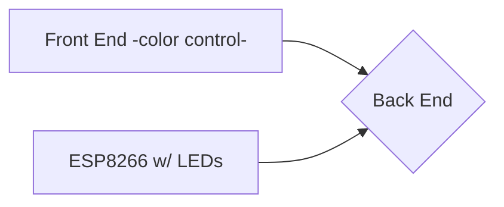

# Make Internet Controlled LED Strips with ESP8266, Arduino, NodeJS, and a Fancy front end

This tutorial is going to show you how to make a internet controlled LED strip using ESP8266/Arduino/WS2812B LEDs for hardware and NodeJS/HTML/CSS/JS for the front and back end.

The ESP for the LEDs also uses WiFi Manager and SPIFFS to dynamically connect the device to WiFi (without requiring reprogramming), and to store any API keys or RGB color values in the flash so it is persistent across reboot. Like how if you unplug an IoT device and plug it back it, it still knows how to connect to WiFi and knows it belongs to your account.

While MQTT would serve as a perfect utility here (especially using something like Blynk as an app for controlling the colors, as well as easy control from mobile), I wanted to get something up and running relatively quickly, while also doing everything pretty much myself (yes there is a lot of code snagging). Setting up MQTT is quite annoying and if it's not something you already understand well then learning it here would not be advised. Using MQTT would require at a minimum adding it to both the device and the back end, front end could be optional.

## Programming

There is a lot of code here, **a lot**. Between the back end(s), front end, and Arduino code, doing a walkthrough programming tutorial would be absurd. Instead, I am going to highlight the core features of the code that makes it so special (I don't need to explain how to setup an express server now do I?). I'll get to more of the code later.

## Wiring
There are a bunch of ways to handle wiring up the LEDs so I am going to let you do that on your own account. Personally I used an external power supply for both the LEDs and the ESP8266, and made all of the ground connect. I put a 370ohm resistor (you can use anything just put something there) between the data pin of the ESP and the LEDs, and a 1000µf capacitor to protect the electronics from surges. Here is a diagram similar to what I did:

## Diagram of Data

This is how all of the data flows:

Simple, right?
